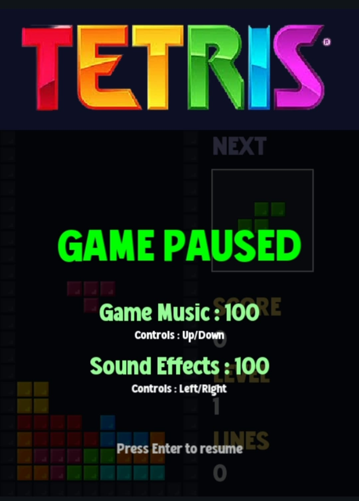

# 🎮 TETRIS – Classic Puzzle Game in C++ with SFML

A polished and modern remake of the legendary **Tetris** game, written in **C++** using **SFML**.  
This version includes smooth controls, colorful textures, immersive sounds, name input, highscores, and a fully interactive menu system.  
Built from scratch with modular code and a complete game loop — great for playing, learning, or extending.

---

## 🚀 Features

- 🎮 **Classic Tetris Gameplay** with 7 standard tetrominoes (I, O, T, S, Z, L, J)
- 🎨 **Colorful Blocks** with smooth SFML rendering
- 🎼 **Sound Effects and Music**:
  - Background soundtrack
  - Line clear, hard drop, and motion effects
  - Menu and countdown audio
- 🧠 **Name Input + High Score Saving**
- 📈 **Score, Level, and Line Tracking**
- 🧾 **In-Game Rules & Controls Screen**
- ⏱️ **Countdown Before Starting**
- ⏸️ **Pause Menu** with volume controls for music and SFX
- 🎛️ **Custom Font and Title Graphics**
- ✅ **Modular Codebase** with organized classes (`Grid`, `Tetromino`, `Manager`, `Menu`)
- 🖥️ Built in **C++17** using **SFML 2.5**

---

## 🧠 Gameplay Overview

- **Score System**:
  | Lines Cleared | Points (× Level) |
  |---------------|------------------|
  | 1 Line        | 40               |
  | 2 Lines       | 100              |
  | 3 Lines       | 300              |
  | 4 Lines       | 1200             |

- **Leveling Up**: Every 10 lines increases your level (which also increases speed)

- **Game Over**: Happens when a new Tetromino cannot be placed due to blockage

---

## ⌨️ Basic Controls

| Action              | Key            |
|---------------------|----------------|
| Move Left           | ← Arrow        |
| Move Right          | → Arrow        |
| Soft Drop           | ↓ Arrow        |
| Hard Drop           | Spacebar       |
| Rotate              | ↑ Arrow        |
| Pause/Resume        | Enter          |
| Mute/Unmute         | M              |
| Menu Navigation     | ↑ / ↓ + Enter  |

---

## 🗂️ Project Structure

```
TetrisGame/
├── Tetris/
│   ├── Source.cpp          # Main game loop
│   ├── Grid.h              # Manages game field and Tetromino placement
│   ├── Tetromino.h         # Shape data, collision, and movement
│   ├── Manager.h           # Player name input & highscores
│   ├── Menu.h              # Main menu system
│   ├── Sounds/             # All game audio (MP3)
│   ├── Blocks/             # Block textures (PNG)
│   ├── Gayo Land.ttf       # Custom font
│   ├── Tetris Logo.png     # Main menu title
│   ├── Tetris Title.png    # In-game title bar
│   └── scores.txt          # Saved highscores
├── Tetris.sln              # Visual Studio solution (optional)
├── README.md               # This file
└── .gitignore              # VS build exclusions
```

---

## 🛠️ How to Build & Run

### ✅ Prerequisites
- C++17 compiler
- [SFML 2.5.1](https://www.sfml-dev.org/)
- Visual Studio 2019 or newer (recommended)

### 🏗️ Build Steps

1. Clone this repo:
   ```bash
   git clone https://github.com/your-username/Tetris-CPP.git
   cd Tetris-CPP
   ```

2. Open `Tetris.sln` in Visual Studio

3. Make sure SFML is properly linked:
   - **Include directories** for `SFML/include`
   - **Library directories** for `SFML/lib`
   - Link against:
     ```
     sfml-graphics.lib
     sfml-window.lib
     sfml-system.lib
     sfml-audio.lib
     ```

4. Build the project (Debug or Release)

5. Play and enjoy!

---

## 📸 Screenshots




---

## 📽️ Gameplay Demo

Click the image below to watch the gameplay !\
[](https://github.com/bilalxfna/TETRIS/releases/download/fna.v1/TETRIS.Final.Gameplay.mp4)

---

## 📜 License

This project is licensed under the **MIT License**.

```
MIT License © 2025 Bilal  
Permission is hereby granted, free of charge, to any person obtaining a copy of this software and associated documentation files...
```

See [LICENSE](./LICENSE) for full terms.

---

## 🙌 Credits

- 🎨 Game Design & Code: **Bilal**
- 🎵 Soundtrack: Public domain + personal edits
- 💻 Framework: [SFML](https://www.sfml-dev.org/)
- 🎮 Inspired by: Classic **Tetris** (© Alexey Pajitnov)

